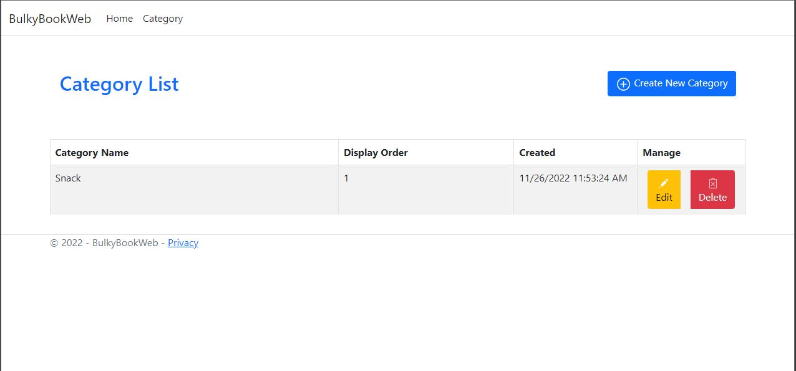
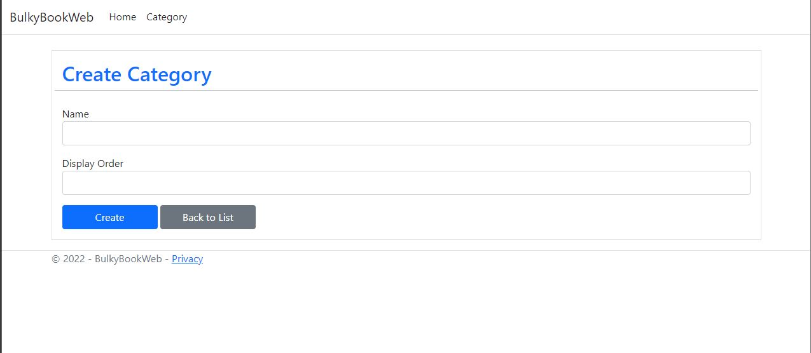
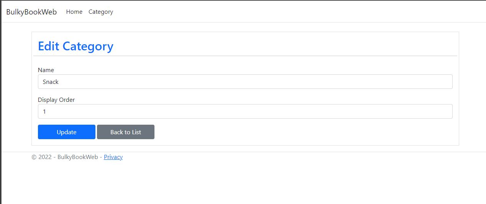
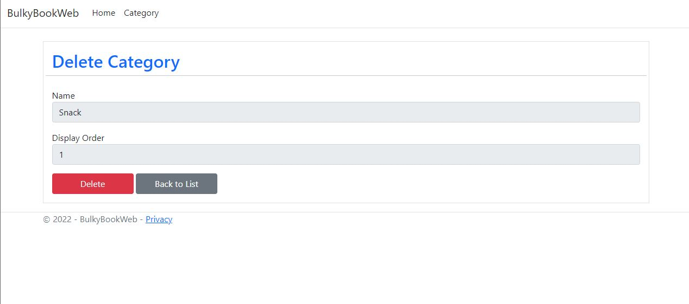

# BulkyBookWeb

STEPS TO CREATE DATABASE TABLE MIGRATION
- To create database migration, open Package Manager Console
- In the package manager terminal run, 'add-migration AddCategoryToDatabase' 
- If you get an error install 'Microsoft.EntityFrameworkCore.Tools' package, then run 'add-migration AddCategoryToDatabase' again.

TO PUSH DATABASE TABLE MIGRATION
- In the package manager terminal run, 'update-database'

========================================================================================

SCREENSHOTS

 
 
 
 
